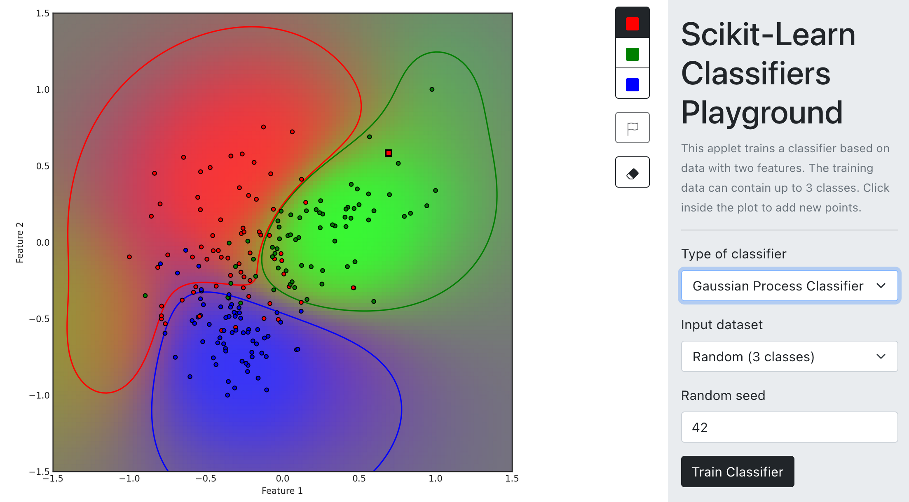

# Scikit-learn Classifiers Playground

**[Try it online](https://www.stefanom.io/sklearn-classifiers-playground/)**

## What is it?
:construction: **NOTE: This document is a work in progress!** :construction:

This web application runs Scikit-learn classifier and Matplotlib in the browser. This is implemented without any server component using [Pyodide](https://pyodide.org/en/stable/). 

The following classifiers can be trained:

* Logistic Regression
* Decision Tree
* Random Forest
* SVM (RBF kernel)
* K-nearest neighbors
* A 2-layer Neural Network
* Gaussian Process

on a variety of 2D datasets.

## Implementation
Briefly, a Python class (`SklearnClassifiers`, defined in [sklearn_classifiers.py](py/sklearn_classifiers.py))  first defines the set of inputs (the type of classifier, the dataset, a random seed, etc.). This set of inputs is used to build the React components in the sidebar ([PyodideApplet](src/PyodideApplet.js)).

On first run, or when the value of the inputs change, the React app calls the `compute()` method defined in `SklearnClassifiers`. This method trains a classifier,  computes a 2D matrix of predictions, plots them on a Matplotlib figure, base64-encodes the output image, and returns it to the React app. Finally, the React app displays the base64-encoded image in an `` tag.

Note that I also implemented (in a very flawed way) the ability to add additional "custom" points to the dataset simply by clicking on the plot. Each point added by the user is draggable. Since the underlying plot is a static image, I overlay draggable elements whose coordinates are sent to the Python code, translated into the Matplotlib figure coordinate space, and added to the dataset used to train the classifier. I will probably remove this code eventually, since it is very hacky.

#### TODOs
- [ ] Run Pyodide in a Web Worker to avoid locking the main thread
- [ ] Switch from Matplotlib to an SVG-based plotting library
- [ ] Add the ability to import a 2D dataset (e.g. as a CSV file)
